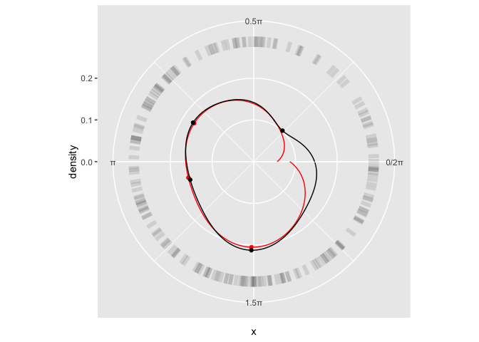

# ggcyclical
R package for tidy analysis of cyclical (circular, periodic, directional, polar) data and plotting with ggplot2

This package extends the package `ggplot2` with functions to plot cyclical data and uses many statistical tools from the package `circular` but without forcing the data format `circular`. It also adds functions to calculate summary statistics of cyclical data in tidy workflows.
  
## Key features
* Circular kernel density estimatiaton in `stat_density_circular` for `geom_density_circular`.
* Add modes (peaks, troughs/valleys) to regular and cyclical density plots with `stat_mode`, `stat_mode_circular`, and `geom_mode_point`.
* Calculate cyclical mean, weighted mean, and standard deviations.

