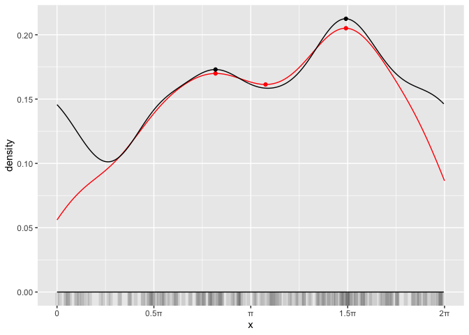
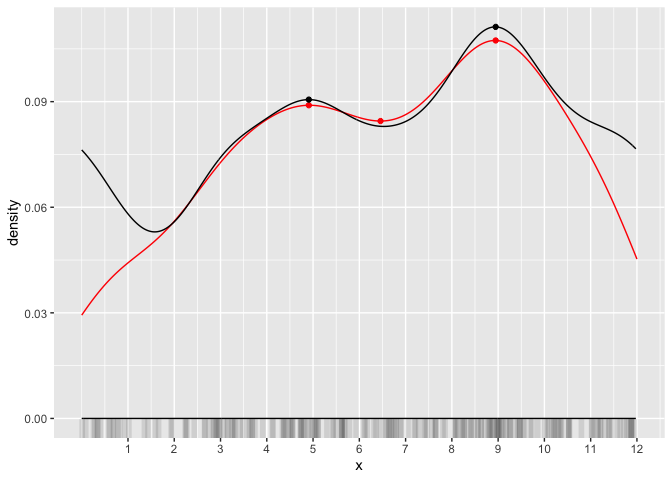
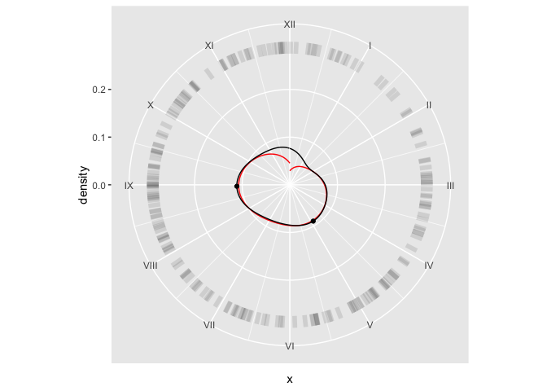

# Basic Circular Density Plots

## Motivations

The smoothed density estimates from `stat_density` underestimate the
actual density at the continuous border in circular data. The density
lines also often fail to join up at the continuous border, gaping the
cyclically continuous density distribution.

The circular density estimates from `stat_density_circular` better
represent circular data (in either carthesian or polar coordinates).

    set.seed("19200725")

    df <- tibble(
      x = c(rnorm(160, pi, 2), rnorm(40, 1.5*pi, 1)),
    ) %>%
      mutate(
        .,
        x = case_when(
          x < 0         ~ (-1 * (abs(x) %% (2 * pi) - 2 * pi)),
          x >= (2 * pi) ~ x %% (2 * pi),
          TRUE ~ x
        )
      )

    df %>%
      ggplot(., aes(x)) +
        geom_rug(alpha = 0.1, linewidth = 2, length = unit(5, "mm")) +
        geom_density(color = "red") +
        geom_point(stat = "mode", color = "red", mode = "both") +
        geom_density_circular() +
        geom_mode_circular(mode = "both") +
        #geom_segment(
        #  aes(xend = after_stat(x), y = after_stat(density), yend = 0),
        #  stat = "mode_circular", mode = "both"
        #) +
        scale_x_continuous(
          limits = c(0, 2 * pi),
          breaks = c(0, 0.5*pi, pi, 1.5*pi, 2*pi),
          labels = c(0, "0.5π", "π", "1.5π", "2π")
        )

    df %>%
      ggplot(., aes(x)) +
        geom_density(color = "red") +
        geom_point(stat = "mode", color = "red", mode = "both") +
        geom_density(stat = "density_circular", color = "black") +
        geom_point(stat = "mode_circular", mode = "both") +
        coord_polar(theta = "x", start = -pi/2, direction = -1) +
        scale_x_continuous(
          limits = c(0, 2 * pi),
          breaks = c(0, 0.5*pi, pi, 1.5*pi, 2*pi),
          labels = c(0, "0.5π", "π", "1.5π", "2π")
        ) +
      scale_y_continuous(limits = c(0, 0.3)) +
      geom_segment(aes(xend = x, y = 0.30, yend = 0.275), alpha = 0.1, linewidth = 2) +
      labs(x = "x", y = "density")

## Bandwidth Selection

The bandwidth parameter for the kernel density estimation (KDE) is
selected differently in linear and circular KDE and these estimates are
generally in a reciprocal relationship to each other. The bandwidth
estimation can take noticeably longer for sample sizes *n* &gt; 1000
with the implementation in the package `circular`. Thus, a rough
estimate of `bw`  = *l**o**g*10(*n*) is used by default (for
now) in `stat_density_circular`. However, also more suitable estimates
are implemented through the circular kernel density estimation methods
from `circular` if desired.

    set.seed("19200725")
    df <- tibble(
      wide = rnorm(1000, pi, 2),
      narrow = rnorm(1000, pi, 0.2)
    ) %>%
      pivot_longer(
        .,
        cols = everything(),
        names_to = "group",
        values_to = "x"
      ) %>%
      mutate(
        .,
        x = case_when(
          x < 0       ~ -1 * (abs(x) %% (2 * pi) - 2 * pi),
          x >= 2 * pi ~      (abs(x) %% (2 * pi) - 2 * pi),
          TRUE ~ x
        )
      )

    df %>%
      ggplot(., aes(x)) +
        facet_wrap(facets = ~ group) +
        geom_rug(alpha = 0.1, linewidth = 2, length = unit(5, "mm")) +
        geom_density(color = "red") +
        geom_density_circular(color = "blue", bw = "log") +
        geom_density_circular(color = "black", bw = "mse") +
        scale_x_continuous(limits = c(0, 2 * pi)) +
        scale_y_continuous(expand = expansion(add = c(0.25, 0)))

    df %>%
      ggplot(., aes(x)) +
        facet_wrap(facets = ~ group) +
        geom_segment(aes(xend = x, y = 2.25, yend = 2.45), alpha = 0.1, linewidth = 2) +
        geom_density(color = "red") +
        geom_density(stat = "density_circular", color = "blue", bw = "log") +
        geom_density(stat = "density_circular", color = "black", bw = "mse") +
        coord_polar(theta = "x", start = -pi/2, direction = -1) +
        scale_x_continuous(limits = c(0, 2 * pi), breaks = c(0, 0.5*pi, pi, 1.5*pi, 2*pi), labels = c(0, "0.5π", "π", "1.5π", "2π")) +
        scale_y_continuous(expand = expansion(add = c(0.25, 0)))

## Types of cyclic data

Cyclic datasets are common in natural sciences and include for example
wind directions, optimal angles, preferred movement directions of
microbes under chemotaxis, and many temporal datasets.

In `stat_density_circular`, all calculations are internally performed on
the unit circle (0,2*π*). Any cyclical data is transformed using the
period $\frac{2\pi x}{\text{period}}$ and the normalized densities are
converted back before output. This transformation is controlled by the
parameter `period`. Thus, the output seamlessly integrates in `ggplot2`
and can be scaled like other polar data.

    df <- tibble(
      x = c(rnorm(160, pi, 2), rnorm(40, 1.5*pi, 1)),
    ) %>%
      mutate(
        .,
        x = case_when(
          x < 0         ~ (-1 * (abs(x) %% (2 * pi) - 2 * pi)),
          x >= (2 * pi) ~ x %% (2 * pi),
          TRUE ~ x
        ),
        x = (x * 12) / (2 * pi)
      )

    df %>%
      ggplot(., aes(x)) +
        geom_rug(alpha = 0.1, linewidth = 2, length = unit(5, "mm")) +
        geom_density(color = "red") +
        geom_mode_point(color = "red", mode = "both") +
        geom_density_circular(period = 12, color = "black") +
        geom_mode_point(stat = "mode_circular", period = 12, mode = "both", color = "black") +
        scale_x_continuous(
          limits = c(0, 12),
          breaks = 1:12
        )

    df %>%
      ggplot(., aes(x)) +
        geom_density(color = "red") +
        geom_density_circular(period = 12, color = "black") +
        geom_point(stat = "mode_circular", mode = "both", period = 12, color = "black") +
        geom_segment(aes(xend = x, y = 0.30, yend = 0.275), alpha = 0.1, linewidth = 2) +
        coord_polar(theta = "x", start = 0, direction = 1) +
        scale_x_continuous(
          limits = c(0, 12),
          breaks = 1:12,
          labels = as.roman(1:12)
        ) +
        scale_y_continuous(limits = c(0, 0.3)) +
        labs(x = "x", y = "density")

